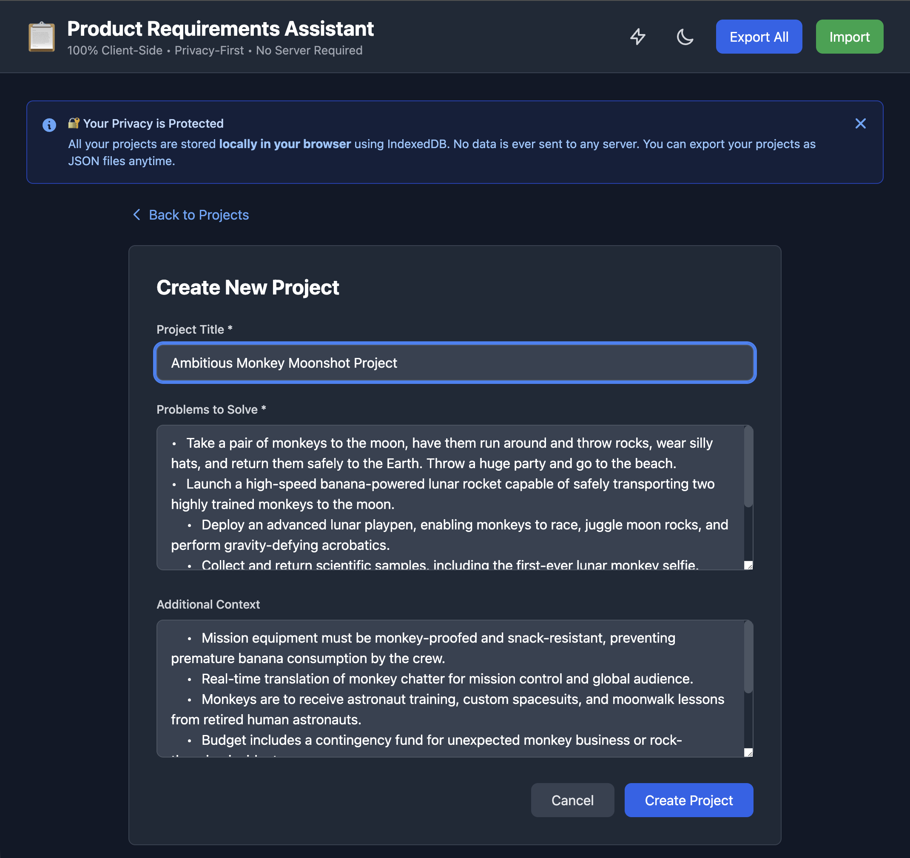
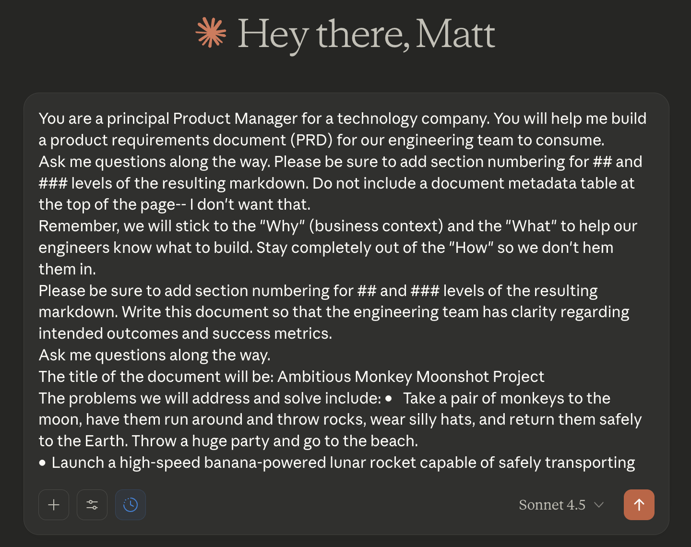
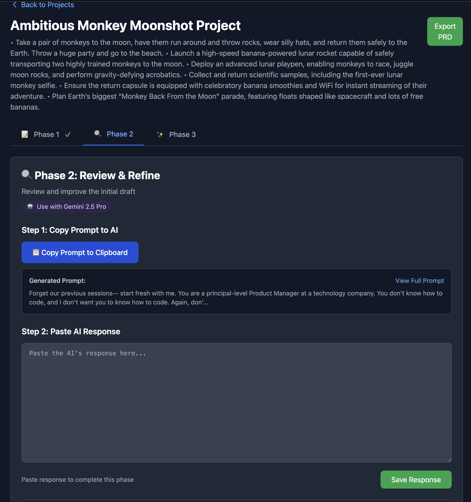

# Product Requirements Assistant

A structured 3-phase workflow tool for creating Product Requirements Documents with AI assistance.

**🌐 [Launch Web App](https://bordenet.github.io/product-requirements-assistant/)**

## Quick Start

**🌐 [Launch Web App](https://bordenet.github.io/product-requirements-assistant/)**

No installation required. Works on any device with a modern browser. All data stored locally in your browser.

## Features

- **3-Phase Workflow**: Initial draft (Claude), review (Gemini), finalization (Claude)
- **Copy/Paste Integration**: Works with Claude Sonnet 4.5 and Gemini 2.5 Pro
- **Local Storage**: Projects stored as JSON with markdown export
- **Privacy-First**: 100% client-side, no server, no tracking

## Screenshots

See the workflow in action with our light-hearted "MonkeyMoonshot" example (Phase 1 workflow):

📋 <strong>Step 1: Generate Phase 1 Prompt</strong> - Capture the base rudiments of a PRD

*The tool generates a Phase 1 prompt optimized through evolutionary testing. Copy this prompt.*

🤖 <strong>Step 2: Generate prompt for Claude</strong> - Compose a prompt for Claude, specifying your initial input

*Copy the prompt the tool generates for Claude. This instructs Claude (eg Opus or Sonnet 4.5) to generate a first draft PRD.*

✍️ <strong>Step 3: Claude Disambiguation</strong> - Dialog with Claude to establish a working Product Requirements Document

*Claude asks clarifying questions to arrive at a working PRD draft with detailed sections.*

✅ <strong>Step 4: Claude Completes Draft</strong> - Finalize the first PRD document

*Claude finishes the initial PRD draft. Now copy this entire response.*

📥 <strong>Step 5: Paste Back into Tool</strong> - Prepare the PRD document for Gemini's scrutiny

*Paste Claude's PRD draft back into our tool. The tool captures the response.*

📥 <strong>Step 6: Prepare Gemini for Adversarial Review</strong> - Build an adversarial prompt for Gemini, instructing it to generate an alernate rendition

*This step helps create a competing version that we'll benefit from.*

🎯 <strong>Step 7: Commence Phase 3</strong> - Phase 1 and 2 complete, starting Phase 3

*Phases 1 and 2 are complete! The tool now has both Claude's initial PRD and Gemini's review. You're ready to start Phase 3 (final synthesis).*

> **Note:** These screenshots demonstrate the complete Phase 1 workflow: generate prompt in our tool → paste into Claude Code → paste Claude's response back into our tool. The final screenshot shows the tool ready to start Phase 3 after completing Phases 1 and 2. The same copy/paste pattern continues throughout all phases.

## How It Works

1. **Create Project**: Enter title, problems, and context
2. **Phase 1**: Copy prompt to Claude Sonnet 4.5, paste response back
3. **Phase 2**: Copy prompt to Gemini 2.5 Pro, paste response back
4. **Phase 3**: Copy prompt to Claude, paste final PRD
5. **Export**: Download as markdown with full revision history

## For Developers

Interested in contributing or running from source? See:

- [Contributing](CONTRIBUTING.md) - Development guidelines
- [Evolutionary Optimization](PROMPT-FOR-GENESIS-EVOLUTIONARY-INTEGRATION.md) - LLM prompt tuning methodology

## Evolutionary Prompt Optimization

This repository contains the authoritative implementation of evolutionary prompt optimization:

- **+31.1% quality improvement** in 20 rounds (data-driven)
- **Objective scoring** with keep/discard logic
- **Proven mutation library** (Top 5 mutations deliver 71-73% of improvement)

Key files:

- `tools/evolutionary-optimizer.js` - Core optimization engine
- `tools/prd-scorer.js` - Objective PRD quality scorer
- `evolutionary-optimization/` - Test cases and results
- [`PROMPT-FOR-GENESIS-EVOLUTIONARY-INTEGRATION.md`](PROMPT-FOR-GENESIS-EVOLUTIONARY-INTEGRATION.md) - Integration guide

## License

MIT License - see [LICENSE](./LICENSE)
