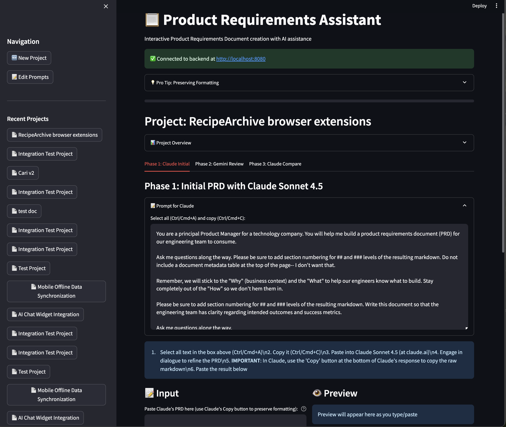
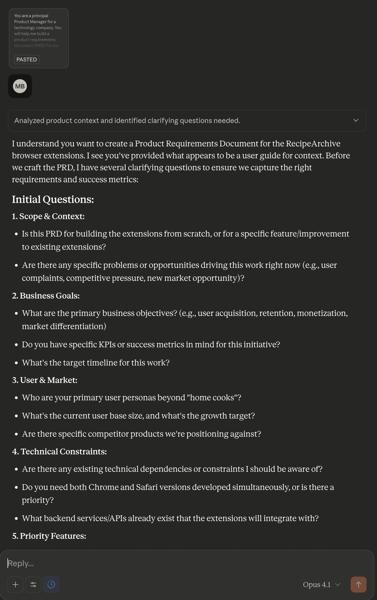

# Product Requirements Assistant

[](https://github.com/bordenet/product-requirements-assistant/actions/workflows/ci.yml)
[](https://app.codecov.io/github/bordenet/product-requirements-assistant)

[](https://go.dev/)
[](https://www.python.org/)
[](LICENSE)
[](https://github.com/bordenet/product-requirements-assistant/releases/latest)

A structured 3-phase workflow tool for creating Product Requirements Documents with AI assistance.

**🌐 Try it now: [https://bordenet.github.io/product-requirements-assistant/](https://bordenet.github.io/product-requirements-assistant/)**

## Quick Start

### Option 1: Web App (Easiest - No Download Required)

Use the web app directly in your browser - no installation needed:

**🌐 [Launch Web App](https://bordenet.github.io/product-requirements-assistant/)**

- ✅ No download required
- ✅ Works on any device (Windows, Mac, Linux, mobile)
- ✅ 100% client-side - all data stored in your browser
- ✅ Privacy-first - no server, no tracking
- ✅ Export/import projects as JSON

### Option 2: Windows Standalone Executable

Download and run a single executable - no installation or dependencies required:

1. Download [PRD-Assistant-Windows.exe](https://github.com/bordenet/product-requirements-assistant/releases/tag/v0.5.0) (5.7 MB)
2. Double-click to run
3. Browser opens automatically to http://localhost:8080

**Note**: Windows may show a security warning (app is not code-signed). Click "More info" → "Run anyway".

**What it does:**
- Starts a local web server
- Opens your browser automatically
- All data stored in your browser (privacy-first)
- No installation, no Python, no dependencies

### Option 3: Manual Setup (For Developers)

If you prefer to run from source or need to customize:

1. Install Python 3.8+ if needed: [python.org/downloads](https://www.python.org/downloads/)
2. Clone this repository or download as ZIP
3. Run the setup script: Open PowerShell in the project folder and run:
   ```powershell
   .\scripts\setup-windows.ps1
   ```
4. The application will open at http://localhost:8501

See [QUICK_START_WINDOWS.md](QUICK_START_WINDOWS.md) for detailed instructions and troubleshooting.

---

## Features

- 3-Phase Workflow: Initial draft (Claude), review (Gemini), finalization (Claude)
- Copy/Paste Integration: Works with Claude Sonnet 4.5 and Gemini 2.5 Pro
- Local Storage: Projects stored as JSON with markdown export
- Interactive UI: Streamlit-based web interface with live preview

## Screenshots


*Phase 1: Initial PRD generation with customizable prompts*


*Copy/paste workflow with Claude Sonnet 4.5*

## Platform Support

### Web App (Recommended - All Platforms)
- **Live Demo**: [https://bordenet.github.io/product-requirements-assistant/](https://bordenet.github.io/product-requirements-assistant/)
- **Platform**: Any device with a modern browser (Windows, Mac, Linux, mobile)
- **Requirements**: None - 100% client-side
- **Privacy**: All data stored locally in browser (IndexedDB)
- **Features**: Full 3-phase workflow, export/import projects

### Windows (Current Release v0.5.0)
- **Standalone Executable**: Single .exe file (5.7 MB, no dependencies)
- **Manual Setup**: Run from source with Python 3.8+ and Go backend
- Download: [v0.5.0 Release](https://github.com/bordenet/product-requirements-assistant/releases/tag/v0.5.0)

### Local Development
- Clone repository and run from source
- Local testing: `cd web && python3 -m http.server 8000`
- Deployment: Compatible with CloudFront, GitHub Pages, Netlify, or any static host

### macOS and Linux
- Build from source (see [Development Guide](docs/development/DEVELOPMENT.md))
- Electron builds available (see `cmd/electron/`)

## Architecture

- **Backend**: Go REST API on port 8080
- **Frontend**: Streamlit web UI on port 8501 (desktop) / Vanilla JS (web)
- **Storage**: Local filesystem (desktop) / IndexedDB (web)

## Download

### Web App (Recommended)
**🌐 [Launch Web App](https://bordenet.github.io/product-requirements-assistant/)**

No download required! Works on any device with a modern browser.

### Windows Standalone Executable (v0.5.0)
- File: `PRD-Assistant-Windows.exe` (5.7 MB)
- Description: Self-contained executable with embedded web app
- Requirements: None (no installation, no dependencies)
- Download: [v0.5.0 Release](https://github.com/bordenet/product-requirements-assistant/releases/tag/v0.5.0)

### Build from Source
For developers or other platforms, see:
- [Development Guide](docs/development/DEVELOPMENT.md)
- [Thick Clients Guide](docs/guides/THICK_CLIENTS_GUIDE.md)

---

## For Developers

The sections below are for developers who want to build from source or contribute.

If you want to use the application, download the pre-built executable above.

---

## Development Setup (Developers Only)

### Quick Start

**macOS/Linux:**
```bash
./run.sh [-y|--yes]
```

**Windows (WSL - Ubuntu/Debian):**
```bash
./scripts/setup-windows-wsl.sh [-y|--yes]
```

**Windows (PowerShell - native, no WSL required):**
```powershell
.\scripts\setup-windows.ps1 [-AutoYes]
```

The setup scripts will:
- Install Go and Python if needed (via Homebrew/apt/Chocolatey)
- Install project dependencies
- Run tests
- Check for processes on ports 8080/8501 and offer to kill them
- Start backend and frontend
- Open http://localhost:8501

### Platform-Specific Scripts

**macOS:**
```bash
./scripts/setup-macos.sh [-y|--yes]
```

**Linux:**
```bash
./scripts/setup-linux.sh [-y|--yes]
```

**Windows WSL:**
```bash
./scripts/setup-windows-wsl.sh [-y|--yes]
```

**Windows PowerShell:**
```powershell
.\scripts\setup-windows.ps1 [-AutoYes]
```

Stop with `Ctrl+C`.

### Manual Setup

```bash
# Install dependencies
make install

# Terminal 1 - Backend
make run-backend

# Terminal 2 - Frontend
make run-frontend
```

Then open http://localhost:8501

## Usage

1. **Create Project**: Enter title, problems, and context
2. **Phase 1**: Copy prompt → Claude Sonnet 4.5 → paste response back
3. **Phase 2**: Copy prompt → Gemini 2.5 Pro → paste response back
4. **Phase 3**: Copy prompt → Claude → paste final PRD
5. **Export**: Download as markdown with full revision history

## Project Structure

```
product-requirements-assistant/
├── backend/                    # Go REST API server (port 8080)
├── frontend/                   # Streamlit web UI (port 8501)
├── web/                        # Browser-based web app (100% client-side)
│   ├── js/                    # JavaScript modules
│   ├── css/                   # Styles
│   ├── data/                  # Default prompts
│   └── README.md              # Web app documentation
├── cmd/                        # Desktop application launchers
│   ├── electron/              # Electron client (~150MB)
│   └── webview/               # WebView2 client (~10MB)
├── scripts/                    # Automation scripts
│   ├── setup-*.sh             # Platform-specific setup
│   ├── validate-monorepo.*    # Code quality validation
│   ├── release.py             # Release automation
│   └── README.md              # Scripts documentation
├── prompts/                    # AI prompt templates
│   ├── claude_initial.txt     # Phase 1 prompt
│   ├── gemini_review.txt      # Phase 2 prompt
│   ├── claude_compare.txt     # Phase 3 prompt
│   └── README.md              # Prompts documentation
├── docs/                       # Documentation
│   ├── architecture/          # System design and API
│   ├── deployment/            # Deployment and releases
│   ├── development/           # Dev tools and workflows
│   ├── decisions/             # Design decisions
│   ├── guides/                # User guides
│   ├── _archive/              # Obsolete docs (historical)
│   └── README.md              # Documentation index
├── outputs/                    # Generated PRDs (local storage)
├── testdata/                   # Test fixtures
├── Makefile                    # Common development commands
├── run.sh                      # Quick start script
├── CONTRIBUTING.md             # Contribution guidelines
└── README.md                   # This file
```

**See also:**
- [`docs/README.md`](docs/README.md) - Complete documentation index
- [`scripts/README.md`](scripts/README.md) - Scripts reference
- [`prompts/README.md`](prompts/README.md) - Prompts documentation
- [`web/README.md`](web/README.md) - Web app guide

## Configuration

**Prompt Templates**: Edit in UI or directly in `prompts/` directory

**Validation Limits**:
- Title: 200 characters
- Problems/Description: 100KB
- Context: 50KB
- PRD Content: 200KB
- Max Request Size: 10MB

## Troubleshooting

**Port already in use:**
```bash
lsof -ti:8080 | xargs kill -9
lsof -ti:8501 | xargs kill -9
```

Or just run the setup script again - it will handle this automatically.

**Logs:**
```bash
tail -f backend.log frontend.log
```

See [`docs/development/LOGGING.md`](docs/development/LOGGING.md) for detailed error documentation.

## Testing

```bash
# Run all tests
make test-all

# Backend tests only
make test-backend

# Integration tests
make test-integration

# Comprehensive validation (recommended before commits)
./scripts/validate-monorepo.sh --quick   # ~1-2 minutes (Unix/Linux/macOS)
./scripts/validate-monorepo.sh --full    # ~3-5 minutes (Unix/Linux/macOS)

# Windows PowerShell
.\scripts\validate-monorepo.ps1 -Quick   # ~1-2 minutes
.\scripts\validate-monorepo.ps1 -Full    # ~3-5 minutes
```

**Validation includes:**
- Dependency checks (Go, Python versions)
- Project structure validation
- Backend build and linting (go vet, gofmt)
- Backend tests (all test suites)
- Frontend linting (flake8, black)
- Security scanning (secret detection) - full mode only
- Git status check - full mode only

### Mock AI for Automated Testing

For automated testing without manual copy/paste, enable Mock AI:

```bash
export MOCK_AI_ENABLED=true
cd backend && go run .
```

Then use the generate endpoint to auto-complete phases:

```bash
# Generate Phase 1 response
curl -X POST http://localhost:8080/api/projects/{project_id}/generate/1

# Generate Phase 2 response
curl -X POST http://localhost:8080/api/projects/{project_id}/generate/2

# Generate Phase 3 response
curl -X POST http://localhost:8080/api/projects/{project_id}/generate/3
```

Note: Mock AI is for testing/development only. See [`docs/development/MOCK_AI.md`](docs/development/MOCK_AI.md) for details.

## Quality Gates

This repository includes automated safety mechanisms:

Pre-Commit Hooks (prevents broken commits):
```bash
# Install hooks (one-time setup)
./scripts/install-hooks.sh
```

The hooks will automatically:
- Block compiled binaries from being committed
- Scan for secrets and credentials
- Ensure code quality before commits

Validation System:
```bash
# Quick validation (dependencies, builds, tests)
./scripts/validate-monorepo.sh --quick

# Full validation (includes security scans)
./scripts/validate-monorepo.sh --full
```

To bypass hooks in emergencies:
```bash
git commit --no-verify -m "Emergency fix"
```
Note: Only use `--no-verify` when absolutely necessary.

## Documentation

Complete Documentation: [`docs/README.md`](docs/README.md)

### Quick Links

For Users:
- [Quick Start (Windows)](QUICK_START_WINDOWS.md) - Download and run on Windows
- [Thick Clients Guide](docs/guides/THICK_CLIENTS_GUIDE.md) - Desktop app user guide
- [Web App Guide](web/README.md) - Browser-based version

For Developers:
- [Architecture](docs/architecture/ARCHITECTURE.md) - System design and tech stack
- [API Reference](docs/architecture/API.md) - Backend REST API
- [Contributing](CONTRIBUTING.md) - Development setup and guidelines
- [Scripts](scripts/README.md) - Automation scripts reference

For DevOps:
- [Releasing](docs/deployment/RELEASING.md) - Creating releases
- [Code Signing](docs/deployment/CODE_SIGNING.md) - Windows security
- [CloudFront Deployment](docs/deployment/CLOUDFRONT_HOSTING.md) - Web app hosting

Development Tools:
- [Mock AI](docs/development/MOCK_AI.md) - Testing with mock responses
- [Logging](docs/development/LOGGING.md) - Debugging and troubleshooting
- [Prompts](prompts/README.md) - AI prompt templates

## Development

Run `make help` to see all available commands.

```bash
# Install dependencies
make install

# Format code
make format

# Run linters
make lint

# Build binary
make build
```

### Creating Releases

Use the automated release tool for semantic versioning:

```bash
# Patch release (bug fixes)
./scripts/release.py patch

# Minor release (new features)
./scripts/release.py minor -m "Add sidebar improvements"

# Major release (breaking changes)
./scripts/release.py major

# Preview release without changes
./scripts/release.py minor --dry-run -v
```

See [`docs/deployment/RELEASING.md`](docs/deployment/RELEASING.md) for detailed release documentation.

## Known Limitations

- No direct API integration (requires manual copy/paste)
- Single user only
- Local storage only
- No real-time collaboration
- No version history beyond 3 phases
- Limited to text-based PRDs

## Future Work

### Planned Improvements (v1.6+)

**Library-Based Architecture**:
- Refactor core business logic into `internal/core/` package
- Enable thick clients to run workflows in-process (no HTTP backend required)
- Reduce memory footprint and startup time for desktop applications
- See [`internal/README.md`](internal/README.md) for details

**Enhanced Testing**:
- Property-based testing for validation logic
- Fuzzing for input sanitization
- Performance benchmarks for file operations
- Cross-client end-to-end test matrix

**Developer Experience**:
- OpenAPI/Swagger specification for REST API
- GraphQL endpoint for flexible queries
- WebSocket support for real-time updates
- Plugin system for custom AI providers

**Deployment Options**:
- Docker Compose for containerized deployment
- Kubernetes manifests for cloud deployment
- Terraform modules for infrastructure as code
- CI/CD templates for GitHub Actions, GitLab CI, Jenkins

**User Features**:
- Version history and diff visualization
- Export to PDF, DOCX, Confluence
- Template library for common PRD types
- Collaborative editing with conflict resolution

See [`docs/decisions/REFACTORING_PLAN.md`](docs/decisions/REFACTORING_PLAN.md) for the detailed roadmap.

## License

MIT License - see [LICENSE](./LICENSE)
