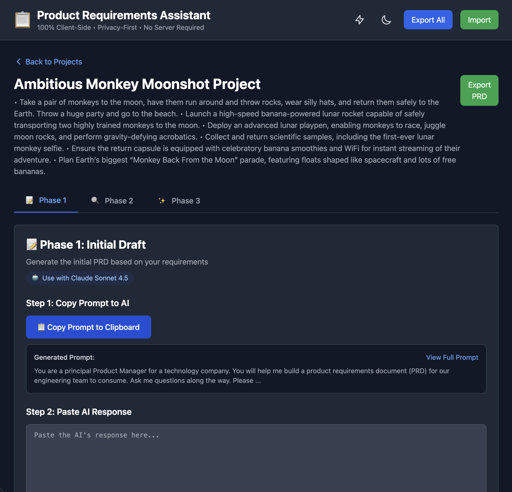
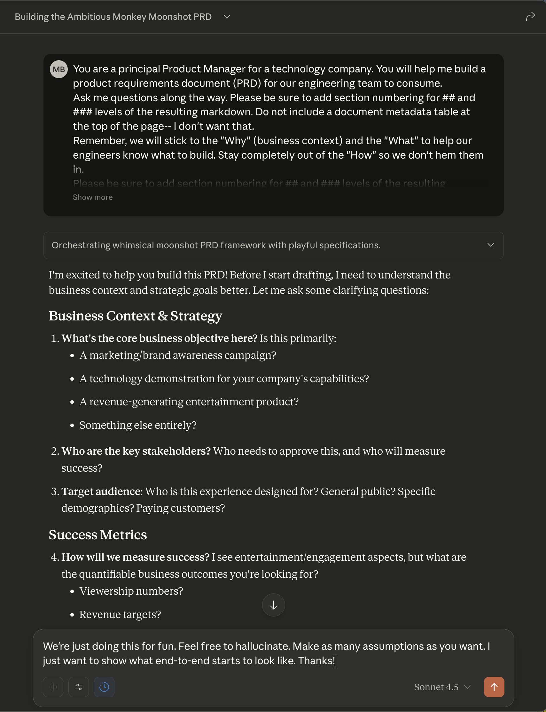

# Product Requirements Assistant

A structured 3-phase workflow tool for creating Product Requirements Documents with AI assistance.

**🌐 [Launch Web App](https://bordenet.github.io/product-requirements-assistant/)**

## Quick Start

**🌐 [Launch Web App](https://bordenet.github.io/product-requirements-assistant/)**

No installation required. Works on any device with a modern browser. All data stored locally in your browser.

## Features

- **3-Phase Workflow**: Initial draft (Claude), review (Gemini), finalization (Claude)
- **Copy/Paste Integration**: Works with Claude Sonnet 4.5 and Gemini 2.5 Pro
- **Local Storage**: Projects stored as JSON with markdown export
- **Privacy-First**: 100% client-side, no server, no tracking

## Screenshots

See the workflow in action with our light-hearted "MonkeyMoonshot" example project:

🤖 <strong>Step 1: Phase 1 - Initial Draft with Claude</strong> - Copy the prompt to Claude Sonnet 4.5

*Copy the generated prompt and paste it into Claude Sonnet 4.5. The prompt is optimized through evolutionary testing.*

📝 <strong>Step 2: Paste Claude's Response</strong> - Capture the initial PRD draft

*Paste Claude's response back into the app. Your initial PRD draft is now saved and ready for review.*

🔍 <strong>Step 3: Phase 2 - Review with Gemini</strong> - Get a second perspective

*Copy the Phase 2 prompt to Gemini 2.5 Pro for an independent review and refinement of the draft.*

✨ <strong>Step 4: Continue the Workflow</strong> - Complete Phase 2 and Phase 3

*Continue by pasting Gemini's response, then proceed to Phase 3 for final comparison and synthesis.*

> **Note:** These screenshots demonstrate the copy/paste workflow pattern through Phase 1 and the start of Phase 2. The same pattern continues through Phase 2 completion and Phase 3 for final PRD synthesis.

## How It Works

1. **Create Project**: Enter title, problems, and context
2. **Phase 1**: Copy prompt to Claude Sonnet 4.5, paste response back
3. **Phase 2**: Copy prompt to Gemini 2.5 Pro, paste response back
4. **Phase 3**: Copy prompt to Claude, paste final PRD
5. **Export**: Download as markdown with full revision history

## For Developers

Interested in contributing or running from source? See:

- [Contributing](CONTRIBUTING.md) - Development guidelines
- [Evolutionary Optimization](PROMPT-FOR-GENESIS-EVOLUTIONARY-INTEGRATION.md) - LLM prompt tuning methodology

## Evolutionary Prompt Optimization

This repository contains the authoritative implementation of evolutionary prompt optimization:

- **+31.1% quality improvement** in 20 rounds (data-driven)
- **Objective scoring** with keep/discard logic
- **Proven mutation library** (Top 5 mutations deliver 71-73% of improvement)

Key files:

- `tools/evolutionary-optimizer.js` - Core optimization engine
- `tools/prd-scorer.js` - Objective PRD quality scorer
- `evolutionary-optimization/` - Test cases and results
- [`PROMPT-FOR-GENESIS-EVOLUTIONARY-INTEGRATION.md`](PROMPT-FOR-GENESIS-EVOLUTIONARY-INTEGRATION.md) - Integration guide

## License

MIT License - see [LICENSE](./LICENSE)
